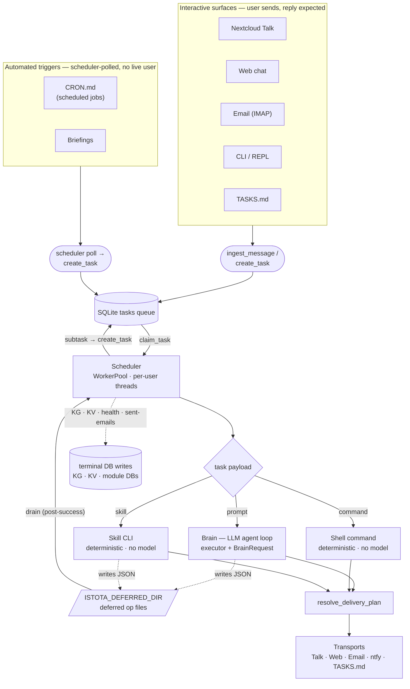
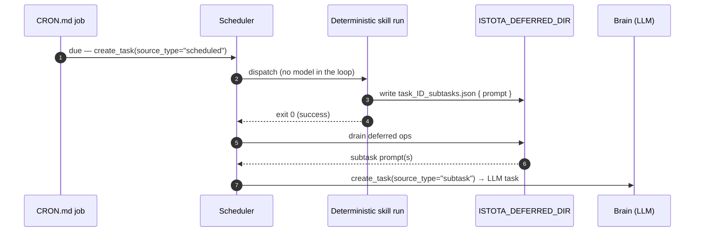

# Architecture overview

Istota is a self-hosted personal AI assistant that runs on your own server and integrates with Nextcloud — files, calendars, and Talk messaging — when you connect it. It dispatches each task to a pluggable **Brain**. Three brains ship behind the same protocol: `ClaudeCodeBrain` (the default) wraps Anthropic's Claude Code CLI as a subprocess, `NativeBrain` runs Istota's own in-process agent loop against any OpenAI-compatible endpoint (Anthropic, OpenRouter, or a local model), and `TmuxClaudeBrain` drives the interactive Claude TUI in a detached tmux session (subscription billing; it composes `ClaudeCodeBrain` for model resolution). Swapping brains doesn't touch executor orchestration. Messages arrive from Nextcloud Talk, the in-app web chat, email, file-based task queues, scheduled jobs, the interactive REPL, or the CLI — each surface sits behind a uniform [Transport](#input-channels) seam. They flow through a SQLite task queue, get claimed by per-user worker threads, and produce responses delivered back to the originating channel.



Tool calling, function dispatch, and the agent loop live in the brain, not the executor — and which code runs them depends on the brain. With `ClaudeCodeBrain` (the default) they are Claude Code's job, so new Claude Code capabilities (tool use, model improvements) come for free. With `NativeBrain` they are Istota's own: an in-process loop that dispatches tools, compacts context, and retries against any OpenAI-compatible model. Either way the executor's job is the same — it constructs the prompt and hands off a `BrainRequest`.

## Core data flow

Every interaction follows the same path:

1. **Input** arrives from one of several channels (Talk message, web chat, email, TASKS.md edit, CLI/REPL command, cron trigger)
2. A **task** is created in the SQLite `tasks` table with status `pending`
3. The **scheduler** dispatches a `UserWorker` thread for the task's user
4. The worker **claims** the task (atomic `UPDATE...RETURNING`, setting status to `locked` then `running`)
5. The **executor** assembles the prompt: persona + resources + memory + context + skills + guidelines + the actual request
6. The executor builds a `BrainRequest` and calls `make_brain(config.brain).execute(req)`. The default `ClaudeCodeBrain` invokes `claude -p - --output-format stream-json` as a subprocess
7. The brain returns a `BrainResult`; the executor composes the final text (CM-aware), stores it in the DB, and delivers it to the originating channel
8. Post-completion: conversation indexed for memory search, deferred DB operations processed, scheduled job counters reset

Task lifecycle: `pending` -> `locked` -> `running` -> `completed` | `failed` | `pending_confirmation` -> `cancelled`

## From schedule to agent: the subtask handoff

A scheduled job is not always an agent invocation. A `CRON.md` job carries one of three payloads, and only the first puts a model in the loop:

- **`prompt`** (or `prompt_file`) — a natural-language request. The task routes straight to the **Brain**: an LLM task.
- **`command`** — a shell command run in a subprocess (`_execute_command_task`). Deterministic, no model.
- **`skill`** — a skill CLI invocation such as `istota-skill feeds run-scheduled` (`_execute_skill_task`, auto-promoted from a pure `istota-skill …` command row). Deterministic, no model.

The dispatch fork lives in `process_one_task`: `task.skill` and `task.command` take the deterministic paths; everything else goes to the Brain.

So how does a "dumb" schedule reach the agent? Through the **deferred subtask** mechanism. The two task paths that run with a deferred directory set — the sandboxed **Brain** path (bwrap mounts its database read-only, so the model can't write the DB directly and defers instead) and the **skill** path (which reuses the same rail) — write JSON op files into `ISTOTA_DEFERRED_DIR`, and the unsandboxed scheduler applies them *after* the task succeeds. A raw shell `command:` row is not given `ISTOTA_DEFERRED_DIR`, so this handoff belongs to skill and Brain tasks, not arbitrary shell commands. One of those file types is a subtask request:

```
$ISTOTA_DEFERRED_DIR/task_${ISTOTA_TASK_ID}_subtasks.json
```

A deterministic **skill** run — including an auto-promoted `istota-skill …` cron row — that emits this file hands its follow-up work to an agent. On success, `_drain_deferred_ops → _process_deferred_subtasks` reads it and calls `db.create_task(source_type="subtask", …)`. A deferred subtask carries a natural-language **`prompt`** — a `command` key is explicitly rejected — so the new task always routes to the Brain. That is the handoff from a deterministic schedule to an LLM task:



Guardrails on this path: subtask creation is **admin-only**, prompt-only (never a nested `command`), rate-limited (`max_subtasks_per_task`, `max_subtask_depth`, `max_subtask_prompt_chars`), and the child's `conversation_token` is pinned to the parent so a subtask can't redirect its own output. The same deferred-writeback rail carries the other post-success writes — knowledge-graph facts, KV entries, health ops, sent-email records — but those are terminal writes to their own stores; only the subtask arm re-enters the task queue.

## Module map

### Input channels

| Module | Purpose |
|---|---|
| `transport/` | Uniform seam over messaging surfaces: `IncomingMessage` / `Transport` protocol / `TransportRegistry` / `ingest_message` (inbound) + `resolve_delivery_plan` (outbound). Six transports ship — Talk, Email, Ntfy, IstotaFile, Repl, Web |
| `transport/talk/inbound.py` | Long-polls Talk conversations, creates tasks, intercepts `!commands`, handles confirmations (the TalkTransport inbound body) |
| `transport/email/inbound.py` | Polls INBOX via IMAP, creates tasks from known senders, downloads attachments (the EmailTransport inbound body) |
| `web_app.py` (`/api/chat/*`) | In-app web chat: POST → `ingest_message` creates a `source_type="web"` task; SSE tails `task_events` |
| `repl/` | Interactive terminal loop (`istota repl`); each line is an inline `source_type="repl"` task streamed to the terminal |
| `tasks_file_poller.py` | Watches TASKS.md files for changes, identifies tasks by SHA-256 content hash |
| `cli.py` | Direct task execution (`istota task "prompt" -u USER -x`), supports `--dry-run` |
| `cron_loader.py` | Reads CRON.md (markdown with embedded TOML), syncs jobs to `scheduled_jobs` DB table |

### Core processing

| Module | Purpose |
|---|---|
| `scheduler.py` | Main loop: daemon mode (long-running with WorkerPool) and single-pass mode |
| `executor.py` | Builds prompts, constructs the per-task environment, orchestrates a `Brain`, composes results |
| `brain/` | Pluggable model-invocation backend: `Brain` Protocol + `make_brain` factory, `BrainRequest`/`BrainResult` types, stream events, `ClaudeCodeBrain` (subprocess + stream-json + transient-API retry), and `NativeBrain` (Istota's in-process agent loop). The native loop's machinery lives in `llm/` (provider abstraction), `agent/` (the loop + tool dispatch), and `session/` (turn state + compaction). |
| `context.py` | Selects relevant conversation history using hybrid recent + LLM-triaged approach |
| `skills/_loader.py` | Loads skill documentation selectively based on keywords, resources, source types |
| `stream_parser.py` | Backward-compat shim — re-exports stream event types from `brain/_events.py` |

### Storage and state

| Module | Purpose |
|---|---|
| `db.py` | All SQLite operations: task CRUD, resources, conversation history, state tracking |
| `config.py` | TOML config loading with nested dataclasses, per-user overrides, secret env vars |
| `storage.py` | Nextcloud filesystem path management, user workspace creation, OCS sharing |

### Memory

| Module | Purpose |
|---|---|
| `memory/sleep_cycle.py` | Nightly orchestration: extracts memories from completed tasks, writes dated files, drives curation and retention |
| `memory/search.py` | Hybrid BM25 + vector search, indexing, and unified chunk retention |
| `memory/knowledge_graph.py` | Temporal entity-relationship triples with validity windows |
| `memory/curation/` | Op-based USER.md curation (parser, ops, prompt, audit) |

See [Memory](../features/memory.md) for the layered design (USER.md, CHANNEL.md, dated memories, recall, knowledge graph) and how each layer enters prompts.

### Output

| Module | Purpose |
|---|---|
| `talk.py` | Async HTTP client for Nextcloud Talk API (send, poll, download attachments) |
| `async_runtime.py` | One persistent asyncio loop + one pooled httpx client for all Talk I/O (`run_coro`, `get_talk_client` singleton); started/stopped by `run_daemon` |
| `notifications.py` | Unified dispatcher for Talk, email, ntfy, and web notifications; per-user purpose-keyed routing table |
| `events.py` | Task-event-streaming: `TaskEvent`, `EventWriter`, `EventSubscriber` + the `task_events` log that feeds every output surface |
| `consumers/` | Event consumers: `TalkEventSubscriber`, `LogChannelSubscriber`, `PushNotificationSubscriber` |
| `commands.py` | Surface-agnostic `!command` dispatch (`CommandContext` + registry), handled synchronously across Talk / web / CLI |

### Modules (in-tree)

| Package | Purpose |
|---|---|
| `feeds/` | Native RSS/Atom/Tumblr/Are.na — poller, per-user SQLite, routes, OPML |
| `health/` | Body stats, bloodwork panels, biomarker trends, Garmin sync, immunizations, medical history |
| `location/` (+ `location_logic.py`) | GPS pings, place detection, visit logging, cluster discovery |
| `money` (vendored) | Beancount ledger, invoicing, transactions, work log |

### Subsystems

| Module | Purpose |
|---|---|
| `heartbeat.py` | Evaluates health checks from HEARTBEAT.md |
| `shared_file_organizer.py` | Scans for files shared with the bot, auto-organizes by owner |
| `nextcloud_client.py` | Shared Nextcloud HTTP plumbing (OCS + WebDAV) |
| `nextcloud_api.py` | Enriches user configs from Nextcloud OCS API at startup |
| `web_app.py` | Authenticated web interface (FastAPI + Nextcloud OAuth2) |
| `webhook_receiver.py` | FastAPI webhook receiver (Overland GPS) |
| `devbox_proxy.py` | Per-user host-side credential proxy for the devbox container |
| `logging_setup.py` | Centralized logging configuration (console, file, rotation) |

## Browser container

The headless browser runs in a Docker container (`docker/browser/`) — Google Chrome driven over a Flask API (with VNC for observation):

| Module | Purpose |
|---|---|
| `browse_api.py` | Flask API endpoints: get, screenshot, extract, interact, close, health |
| `chrome.py` | Chrome process lifecycle and CDP connection management |
| `browsing.py` | Human simulation: Gaussian mouse movements, Bezier curves, scrolling patterns, captcha detection |
| `xdotool.py` | X11 input helpers for CDP-free browser interaction |
| `stealth-extension/` | Chrome extension (manifest v3): overrides navigator properties, WebGL fingerprints, handles cookie consent |

Anti-detection strategy: Chrome launches with the stealth extension natively. Patchright connects via CDP only for content extraction, then disconnects. Navigation uses xdotool keyboard input rather than CDP commands. Human simulation adds 5-10s delays between page actions with realistic mouse movement patterns.

## Design decisions

**Pluggable execution — delegate, or run the loop in-house.** The default brain invokes the existing Claude Code CLI as the execution engine. The native brain instead runs Istota's own in-process agent loop (tool dispatch, context compaction, retries) against any OpenAI-compatible model. A third brain drives the interactive Claude TUI over tmux to keep traffic on subscription billing. Same executor, same skills — the brain is the swappable seam, so Istota isn't bound to one vendor.

**Regular Nextcloud user, not bot API.** The bot runs as an ordinary user. File sharing, CalDAV, and Talk messaging work through standard protocols. No special server configuration.

**File-as-config for user self-service.** Users configure briefings, cron jobs, heartbeats, and persona through markdown files in their Nextcloud workspace. No CLI access needed.

**Functional over object-oriented.** Most code is module-level functions. Classes exist only where shared state across calls is necessary (TalkClient, UserWorker, WorkerPool).

**Graceful degradation everywhere.** Memory search falls back to BM25-only without sqlite-vec. Bubblewrap degrades to unsandboxed on macOS. Mount falls back to rclone CLI. Indexing failures never affect core processing.

**Security by environment, not tool restriction.** Rather than limiting the model's tools, credentials are stripped from the execution environment and optionally routed through a credential proxy.

**Worker-per-user for fairness.** Each user gets their own serial worker thread per queue type (foreground/background). One user's slow task never blocks another.

**Deferred writes for sandbox compatibility.** With bubblewrap making the DB read-only inside the sandbox, skills write JSON files to a writable temp dir. The scheduler processes these after task completion.
